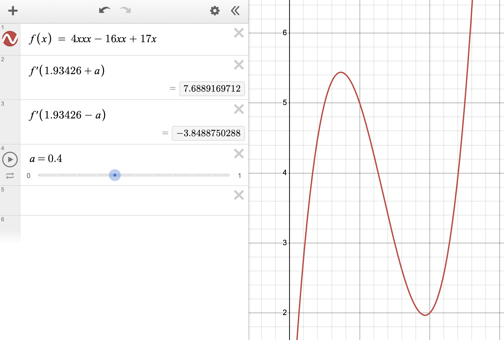

# М5. Автогенератор на туннельном диоде

## Задача

Построить симуляцию автоколебаний (и изучить другие режимы работы) в RLC-контуре с нелинейной вольт-амперной характеристикой диода, параллельно подключенного к конденсатору.

## Модель

Мы построили модель на основании второго правила Кирхгофа для электрических цепей, взяли два уравнения (обход по двум контурам), получили нелинейную систему диффуров

## Входные параметры

### Общие параметры

|          Параметр          | Размерность |     Ограничения      |                                                                                       Обоснование                                                                                       |
|:--------------------------:|:-----------:|:--------------------:|:---------------------------------------------------------------------------------------------------------------------------------------------------------------------------------------:|
|       Сопротивление        |    $Ом$     |  $10^{-5} — 10^{4}$  |                                  Позволяет рассмотреть режимы от почти идеального контура с малыми тепловыми потерями до системы с сильным затуханием.                                  |
|          Емкость           |     $Ф$     | $10^{-12} — 10^{-5}$ |                  Соответствует типичным номиналам радиокомпонентов в реальных контурах. Широкий диапазон позволяет менять волновое сопротивление и частоту колебаний.                   |
|       Индуктивность        |    $Гн$     | $10^{-8} — 10^{-1}$  |                                      Порядки величин подобраны под реальные катушки индуктивности. Влияет на соотношение скорости заряда/разряда.                                       |
| Электродвижущая сила (ЭДС) |     $В$     |  $10^{-5} — 10^{4}$  | Диапазон позволяет смещать рабочую точку по всем участкам ВАХ диода (от участка с отрицательным сопротивлением для генерации, до положительного сопротивления для срыва автоколебаний). |

## Визуализация и режимы работы

В симуляции выводятся графики зависимости тока в катушке и напряжения на конденсаторе от времени. Мы выделили 4 основных режима работы контура, для каждого из которых создан пресет параметров:

1. **Generation (Автогенерация / Почти чистый синус)**
   - *Параметры:* $C=10^{-7}$ Ф, $L=10^{-3}$ Гн, $\varepsilon=1.5$ В.
   - *Обоснование:* Напряжение источника задает рабочую точку на падающем участке ВАХ туннельного диода, где он обладает отрицательным дифференциальным сопротивлением. Оно восполняет потери энергии на резисторе, поддерживая стабильные и практически гармонические автоколебания.
   - *Замечание* Мы сделали тест с дополнительной визуализацей, где можно удостовериться, что мы правда получаем график синуса с заданной точностью. Если кратко, то мы приближаем график уравнением вида $y = a + b \sin(c + \omega t)$, запустить визуализацию приближения можно с помощью команды `uv run python -m tests.tunnel_diode_oscillator.plot`

2. **Warped (Релаксационные колебания / "Кривой синус")**
   - *Параметры:* $C=0.5 \cdot 10^{-8}$ Ф, $L=5 \cdot 10^{-4}$ Гн, $\varepsilon=1$ В.
   - *Обоснование:* Рабочая точка, как и в режиме по умолчанию, лежит на участке с отрицательным сопротивлением, но из-за сильного увеличения индуктивности и уменьшения ёмкости резко возрастает фактор нелинейности системы (волновое сопротивление $\rho = \sqrt{L/C}$). Колебания становятся релаксационными — скорость заряда и разряда конденсатора начинает сильно различаться из-за асимметричности графика ВАХ (которую можно проследить на скриншоте ниже – значения производных существенно различаются), искривляя форму синуса.

3. **Fading (Затухающие колебания)**
   - *Параметры:* $C=10^{-8}$ Ф, $L=10^{-5}$ Гн, $\varepsilon=2$ В.
   - *Обоснование:* Увеличение ЭДС смещает рабочую точку диода за пределы падающего участка — в область положительного дифференциального сопротивления. Диод начинает тоже рассеивать энергию, поэтому колебания быстро затухают, как в обычном пассивном RLC-контуре.

## Команда

- **Кирилл Цимбалюк**
  - модель и расчеты
  - код вычислений
  - тесты
- **Владислав Секин**
  - модель
  - исследование (эксперименты)
  - тесты и их описание
- **Андрей Кругликов**
  - модель
  - визуализация
  - описание

## Запуск

### Простой путь

Достаточно просто зайти на [сайт](https://hsse-physics-labs.tadpole-sirius.ts.net) — там уже все развернуто!

### Локально

Инструкция в [корневом README](/README.md)

## [Тесты](/tests/tunnel_diode_oscillator)
